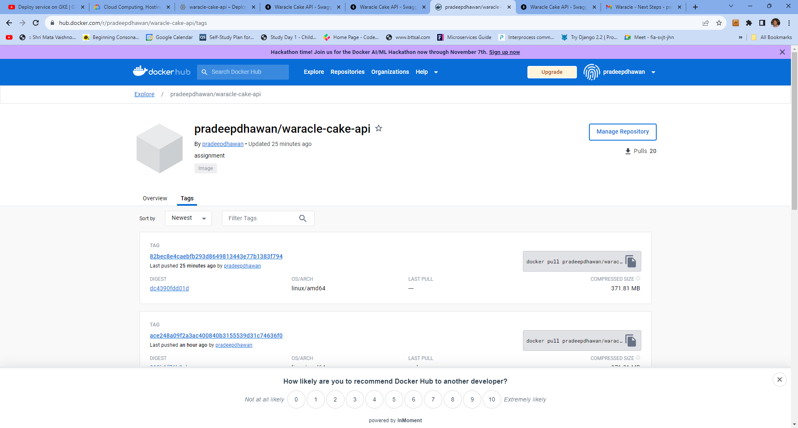
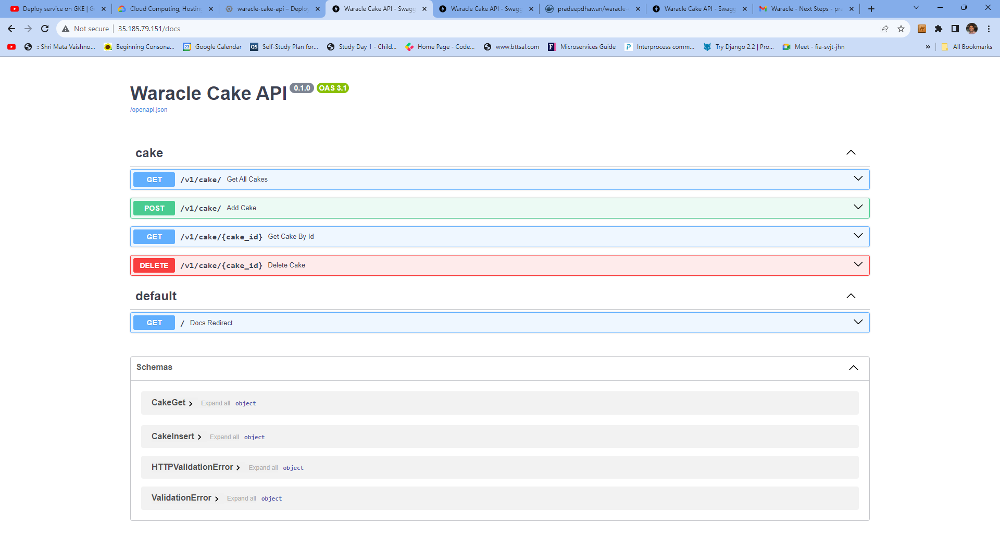
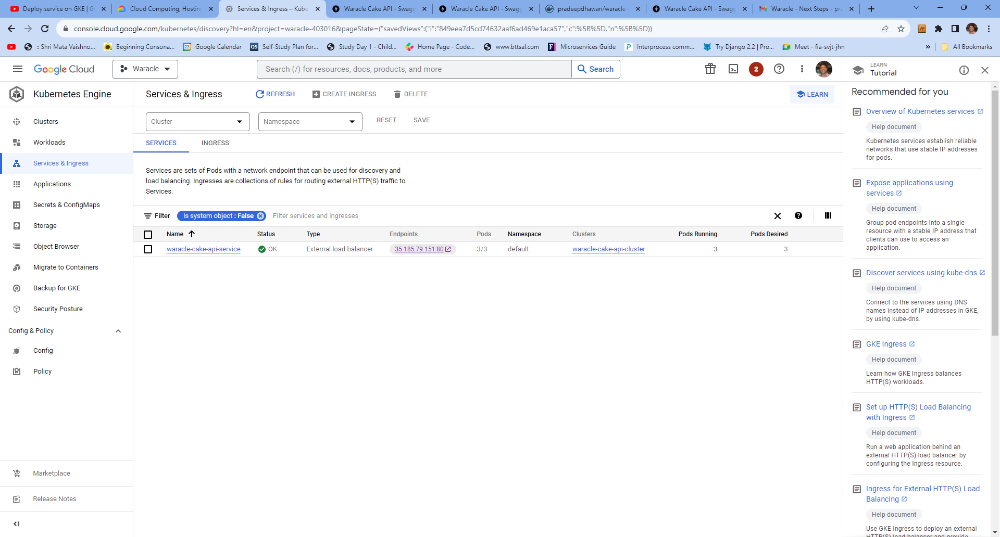
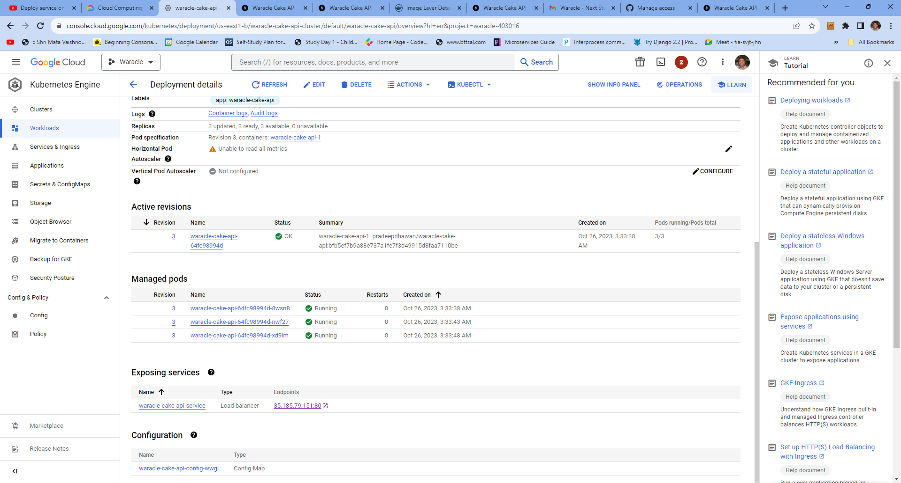
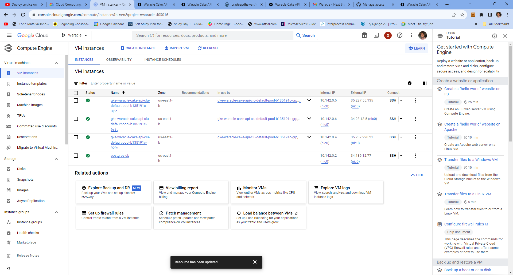

# waracle-cake-api
cake api assignment with hosting using docker and kubernetes

## Requirement
1. The API should return an OpenAPI or Swagger spec. 
2. You should be able to list all cakes.
3. You should be able to add another cake.
4. You should be able to delete an existing cake.
5. All cake data should come from the API, using standard GET/POST/DELETE HTTP
endpoints.

All these requirements have been covered
**Available on http://127.0.0.1:8000/docs#/ if you run locally and http://35.185.79.151/docs#/ via GKE (Google Kubernetes Engine)**

## Additionally
1. For Cake all fields are manadatory
2. ID is autonumber so at time of insert not required (check schema CakeInsert)
3. Name is restricted to 30 characters via model validation as well as postgresDB
4. comment is restricted to 200 characters via model validation as well as postgresDB
5. yumFactor is restricted to be between 1 and 5 inclusive via model validation as well as postgresDB

## Hosting
1. **Docker Image** : since I did not had hypervisor available locally, I was dependent of GITHub Actions to push the images to https://hub.docker.com/r/pradeepdhawan/waracle-cake-api/tags
2. **PostgresSQL** : on Google Cloud VM running docker/container hosting free version of PostgresSQL
    *    POSTGRES_DB:postgres
    *    POSTGRES_HOST:34.139.12.77
    *    POSTGRES_PASS:waracle
    *    POSTGRES_USER:postgres
3. **API**: on Google Kubernetes Engine with a combination of 
    * Load balancer/Ingress
    * Cluster of 3 pods
    * Container Config

## Steps
    1. Create virtual environment : python -m venv .venv
    2. Activate virtual environement : .\.venv\Scripts\activate
    3. Run FastAPI : uvicorn app.main:app --reload
    4. Browse to : http://127.0.0.1:8000 

## Tech stack
    Language: Python
    Framework: FastAPI
    Database: PostgreSQL
    Cloud : GKE (for Web Service)
            Google VM (for PostgreSQL)

## Things that can be done (if we had time)
    1. Unit test cases using pytest
    2. Integration Test cases using BDD (behave)
    3. Host DB with multiple replicas instead of standalone
    4. DB calls to be made async
    5. linting and formatting checks
    6. Sonarcube checks for vunerabilities

